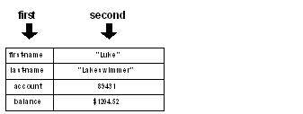

# Chapter 10 - Objects

## Contents:

[1. Overview](#section-1)
[2. Making Objects](#section-2)
[3. Cloning Objects](#section-3)
[4. Accessing Objects](#section-4)
[5. Object Functions](#section-5)
[6. Prototype Objects](#section-6)
[7. Referring to Self](#section-7)
[8. Encapsulation](#section-8)
[9. Reflective Properties](#section-9)

## 1. Overview

Objects group values into a common context. An object can include scalar values, series, functions, and other objects. Objects are useful in dealing with complex structures as they allow related data and code to be encapsulated and passed as a single value to functions.

## 2. Making Objects

New objects are created with the **make** function. The **make** function requires two arguments and returns a new object. The format of the **make** function is:

```
new-object: make parent-object new-values

```

The first argument, `parent-object` , is the parent object from which the new object is made. If no parent object is available, as when defining an initial object, use the **object!** data type, as shown below:

```
new-object: make object! new-values

```

The second argument, `new-values` , is a block that defines additional variables and initial values for the new object. Each variable that is defined within the block is an `instance` variable of the object. For example, if the block contained two variable definitions, then they would be variables of the object:

```
example: make object! [
    var1: 10
    var2: 20
]

```

The `example` object has two variables that hold two integers.

The block is evaluated, so it can include any type of expression to compute the values of the variables:

```
example: make object! [
    var1: 10
    var2: var1 + 10
    var3: now/time
]

```

Once an object has been made, it can serve as a prototype for creating new objects:

```
example2: make example []

```

The above example makes a second instance of the example object. The new object is a clone of the first object. New values for the second object are set in the block:

```
example2: make example [
    var1: 30
    var2: var1 + 10
]

```

In the example above, the `example2` object has different values than the original `example` object for two of its variables.

The `example2` object can also extend the object definition by adding new variables to it:

```
example2: make example [
    var4: now/date
    var5: "example"
]

```

The result is an object that has five variables: Three that came from the original object, `example` , and two new ones.

The process of extending the definition of an object can be repeated any number of times.

You can also create an object that contains variables that are initialized to some common value. This can be done using a cascaded set of word definitions:

```
example3: make object! [
    var1: var2: var3: var4: none
]

```

In the example above, the four variables are set to `none` within the new object.

To summarize, the process of creating an object involves these steps:

- Use make to create a new object based on a parent object or the object! data type.
- Add any new variables that are defined in the block to the new object.
- Evaluate the block, which causes the variables defined in the block to be set to the values in the new object.
- The new object is returned as a result.

## 3. Cloning Objects

When you use a parent object to make a new object, the parent object is cloned rather than inherited. This means that if the parent object is modified, it has no effect on the child object.

As an example, the following code creates a bank account object, whose variables are blank:

```
bank-account: make object! [
    first-name:
    last-name:
    account:
    balance: none
]

```

To use the new object, values can be provided to create an account for a customer:

```
luke: make bank-account [
    first-name: "Luke"
    last-name: "Lakeswimmer"
    account: 89431
    balance: $1204.52
]

```

Since new accounts are made on a regular basis, it helps to use a function and some global variables to create them:

```
last-account: 89431
bank-bonus: $10.00

make-account: func [
    "Returns a new account object"
    f-name [string!] "First name"
    l-name [string!] "Last name"
    start-balance [money!] "Starting balance"
][
    last-account: last-account + 1
    make bank-account [
        first-name: f-name
        last-name: l-name
        account: last-account
        balance: start-balance + bank-bonus
    ]
]

```

Now a new account object for `Fred` would only require:

```
fred: make-account "Fred" "Smith" $500.00

```

## 4. Accessing Objects

Variables within objects are accessed with paths. The path consists of the object name followed by the name of the variable. For example, the following code accesses the variables in the `example` object:

```
example/var1

example/var2

```

Here are examples using the `bank-account` object:

```
print luke/last-name
Lakeswimmer
print fred/balance
$510.00

```

Using a path, the variables of an object can also be modified:

```
fred/balance: $1000.00
print fred/balance
$1000.00

```

You can use the **in** function to access object variables by fetching their words from within their object context:

```
print in fred 'balance
balance

```

The `balance` word returned has the object `fred` as its context. You can get the value it holds by using **get:**

```
print get in fred 'balance
$1000.00

```

The second argument to the **in** function is a literal word. This allows you to dynamically change words depending on what is needed:

```
words: [first-name last-name balance]
foreach word words [print get in fred word]
FredSmith
$1000.00

```

Each word in the block is used to obtain its value in the object.

The **in** function can also be used to set object variables.

```
set in fred 'balance $20.00
print fred/balance
$20.00

```

If a word is not defined within an object, the **in** function returns `none` . This is useful for detecting when a variable exists within an object.

```
if get in fred 'bank [print fred/bank]

```

## 5. Object Functions

An object can contain variables that refer to functions that are defined within the context of the object. This is useful because the functions are encapsulated within the context of the object, and can access the other variables of the object directly, without a need for a path.

As a simple example, the `example` object can include functions for computing new values within the object:

```
example: make object! [
    var1: 10
    var2: var1 + 10
    var3: now/time
    set-time: does [var3: now/time]
    calculate: func [value] [
        var1: value
        var2: value + 10
    ]
]

```

Notice in the example that the functions are able to refer to the variables of the object directly, rather than as paths. That is possible because the functions are defined within the same context as the variables they access.

To set a new time, use:

```
example/set-time

```

This example evaluates the function that sets `var3` to the current time.

To calculate new values for `var1` and `var2` , use:

```
example/calculate 100
print example/var2
110

```

In the case of the `bank-account` object, the functions for `deposit` and `withdraw` can be added to the current definition:

```
bank-account: make bank-account [
    deposit: func [amount [money!]] [
        balance: balance + amount
    ]
    withdraw: func [amount [money!]] [
        either negative? balance [
            print ["Denied. Account overdrawn by"
                absolute balance]
        ][balance: balance - amount]
    ]
]

```

In the example, notice that the functions are able to refer to the `balance` directly within the object. That's because the functions are part of the object's context.

Now if a new account is made, it will contain functions for depositing and withdrawing money. For example:

```
lily: make-account "Lily" "Lakeswimmer" $1000

print lily/balance
$1010.00
lily/deposit $100

print lily/balance
$1110.00
lily/withdraw $2000

print lily/balance
-$890.00
lily/withdraw $2.10
Denied. Account overdrawn by $890.00

```

## 6. Prototype Objects

Any object can serve as a prototype for making new objects. For instance, the `lily` account object previously defined can be used to make new objects with a line such as:

```
maya: make lily []

```

This makes an instance of an object. The object is a copy of the customer object and has identical values:

```
print lily/balance
-$890.00
print maya/balance
-$890.00

```

You can modify the new object while making it by providing the new values within the definition block:

```
maya: make lily [
    first-name: "Maya"
    balance: $10000
]

print maya/balance
$10000.00
maya/deposit $500

print maya/balance
$10500.00
print maya/first-name
Maya

```

The `lily` object serves as a prototype for creating the new object. Any words that are not redefined for the new object continue to have the values of the old object:

```
print maya/last-name
Lakeswimmer

```

New words are added to the object in a similar way:

```
maya: make lily [
    email: maya@example.com
    birthdate: 4-July-1977
]

```

## 7. Referring to Self

Every object includes a predefined variable called `self` . Within the context of an object, the `self` variable refers to the object itself. It can be used to pass the object to other functions or to return it as a result of a function.

In the following example, the s`how-date` function requires an object as its argument and `self` is passed to it:

```
show-date: func [obj] [print obj/date]

example: make object! [
    date: now
    show: does [show-date self]
]

example/show
16-Jul-2000/11:08:37-7:00

```

Another example of using the `self` variable is a function that clones itself:

```
person: make object! [
    name: days-old: none
    new: func [name' birthday] [
        make self [
            name: name'
            days-old: now/date - birthday
        ]
    ]
]

lulu: person/new "Lulu Ulu" 17-May-1980

print lulu/days-old
7366

```

## 8. Encapsulation

An object provides a good way to encapsulate a group of variables that should not appear at the global level. When function variables are defined as globals, they can unintentionally be modified by other functions.

The solution to this problem of global variables is to wrap an object around both the variables and the function. When that is done, the function can still access the variables, but the variables cannot be accessed globally. For example:

```
Bank: make object! [

    last-account: 89431
    bank-bonus: $10.00

    set 'make-account func [
        "Returns a new account object"
        f-name [string!] "First name"
        l-name [string!] "Last name"
        start-balance [money!] "Starting balance"
    ][
        last-account: last-account + 1
        make bank-account [
            first-name: f-name
            last-name: l-name
            account: last-account
            balance: start-balance + bank-bonus
        ]
    ]
]

```

In this example, the variables are safe from accidental modification. Notice that the `make-account` function was set to a variable using the **set** function, rather than using a variable definition. This was done to make it a global function. The function can be used in the same way as functions set with a variable definition, but does not require an object path:

```
bob: make-account "Bob" "Baker" $4000

```

## 9. Reflective Properties

As with many other REBOL data types, you can access the components of objects in a manner that allows you to write useful tools and utilities for creating, monitoring, and debugging them.

The **first** and **second** functions allow you to access the components of an object. The **first** function returns the words defined for an object. The **second** function returns the values that the objects are set to. The following diagram shows the relationship between the return values of **first** and **second:**



The advantage to using **first** is that it allows you to obtain a list of the words for the function without knowing anything else about the function:

```
probe first luke
[self first-name last-name account balance]

```

In the above example, notice that the list contains the word, `self` , which is a reference to the object itself. You can exclude `self` when getting an object's word list by using **next:**

```
probe next first luke
[first-name last-name account balance]

```

Now you have a way to write a function that can probe the contents of an object:

```
probe-object: func [object][
    foreach word next first object [
        print rejoin [word ":" tab get in object word]
    ]
]

probe-object fred
first-name: Luke
last-name: Lakeswimmer
account: 89431
balance: $1204.52

```

When accessing objects in this fashion, care should be taken to avoid infinite loops. For instance, if you attempt to probe certain objects that contain references to themselves, your code may begin an endless loop. This is the reason why you cannot probe the **system** object directly. The **system** object contains many references to itself.