# Series

## Contents:

- [1. Basic Concepts](#section-1)
  - [1.1 Traversing a Series](#section-1.1)
  - [1.2 Skipping Around](#section-1.2)
  - [1.3 Extracting Values](#section-1.3)
  - [1.4 Extracting a Sub-series](#section-1.4)
  - [1.5 Inserting and Appending](#section-1.5)
  - [1.6 Removing Values](#section-1.6)
  - [1.7 Changing Values](#section-1.7)
- [2. Series Functions](#section-2)
  - [2.1 Creation Functions](#section-2.1)
  - [2.2 Navigation Functions](#section-2.2)
  - [2.3 Information Functions](#section-2.3)
  - [2.4 Extraction Functions](#section-2.4)
  - [2.5 Modification Functions](#section-2.5)
  - [2.6 Search Functions](#section-2.6)
  - [2.7 Ordering Functions](#section-2.7)
  - [2.8 Data Set (Group) Functions](#section-2.8)
- [3. Series Datatypes](#section-3)
  - [3.1 Block Types](#section-3.1)
  - [3.2 String Types](#section-3.2)
  - [3.3 Pseudo-types](#section-3.3)
  - [3.4 Type Test Functions](#section-3.4)
- [4. Series Information](#section-4)
  - [4.1 Length?](#section-4.1)
  - [4.2 Head?](#section-4.2)
  - [4.3 Tail?](#section-4.3)
  - [4.4 Index?](#section-4.4)
  - [4.5 Offset?](#section-4.5)
- [5. Making and Copying Series](#section-5)
  - [5.1 Partial Copies](#section-5.1)
  - [5.2 Deep Copies](#section-5.2)
  - [5.3 Initial Copies](#section-5.3)
- [6. Series Iteration](#section-6)
  - [6.1 Foreach Loop](#section-6.1)
  - [6.2 While Loop](#section-6.2)
  - [6.3 Forall Loop](#section-6.3)
  - [6.4 Forskip Loop](#section-6.4)
  - [6.5 The Break Function](#section-6.5)
- [7. Searching Series](#section-7)
  - [7.1 Simple Find](#section-7.1)
  - [7.2 Refinement Summary](#section-7.2)
  - [7.3 Partial Searches](#section-7.3)
  - [7.4 Tail Positions](#section-7.4)
  - [7.5 Backward Searches](#section-7.5)
  - [7.6 Repeated Searches](#section-7.6)
  - [7.7 Matching](#section-7.7)
  - [7.8 Wildcard Searches](#section-7.8)
  - [7.9 Select](#section-7.9)
  - [7.10 Search and Replace](#section-7.10)
- [8. Sorting Series](#section-8)
  - [8.1 Simple Sorting](#section-8.1)
  - [8.2 Group Sorting](#section-8.2)
  - [8.3 Comparison Functions](#section-8.3)
- [9. Series as Data Sets](#section-9)
  - [9.1 Unique](#section-9.1)
  - [9.2 Intersect](#section-9.2)
  - [9.3 Union](#section-9.3)
  - [9.4 Exclude](#section-9.4)
  - [9.5 Difference](#section-9.5)
  - [9.6 Exclude](#section-9.6)
- [10. Multiple Series Variables](#section-10)
- [11. Modification Refinements](#section-11)
  - [11.1 Part](#section-11.1)
  - [11.2 Only](#section-11.2)
  - [11.3 Dup](#section-11.3)

## 1. Basic Concepts

The concept of a series is simple, and it is the fundamental concept that is used everywhere and for nearly everything in REBOL. In order to understand REBOL, you must understand how to create and manipulate series.

A **series** is a **set of values** arranged in a **specific order**.

It's that simple. For example, these are all series:

```
1 2 3 4

A B C D

"ABCD"

10:30 4:20 7:11

```

There are many types of series in REBOL. A block, a string, a list, a URL, a path, an email, a file, a tag, a binary, a bitset, a port, a hash, an issue, and an image are all series and can be accessed and processed in the same way with the same small set of series functions.

### 1.1 Traversing a Series

Since a series is an ordered set of values, you can traverse it from one position to another. As an example, take a series of three colors defined by the following block:

```
colors: [red green blue]

```

There is nothing special about this block. It is a series containing three words. It has a set of values: red, green, and blue. The values are organized into a specific order: red is first, green is second, and blue is third.

The first position of the block is called its `head`. This is the position occupied by the word `red`. The last position of the block is called its tail. This is the position immediately after the last word in the block. If you were to draw a diagram of the block, it would look like this:

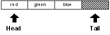

Notice that the tail is just past the end of the block. The importance of this will become more clear shortly.

The variable `colors` is used to refer to the block. It is currently set to the head of the block:

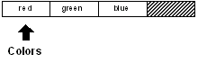

```
print head? colors
true

```

The `colors` variable is at the first index position of the block.

```
print index? colors
1

```

The block has a length of three:

```
print length? colors
3

```

The first item in the block is:

```
print first colors
red

```

The second item in the block is:

```
print second colors
green

```

You can reposition the `colors` variable in the block using various functions. To move the `colors` variable to the next position in the colors block, use the **next** function:

```
colors: next colors

```

The **next** function moves forward one value in the block and returns that position as a result. The `colors` variable is now set to that new position:


The position of the `colors` variable has changed. Now the variable is no longer at the head of the block:

```
print head? colors
false

```

It is at the second position in the block:

```
print index? colors
2

```

However, if you obtain the first item of colors, you get:

```
print first colors
green

```

The position of the value that is returned by the **first** function is relative to the position that `colors` has in the block. The returned value is not the first color in the block, but the first color immediately following the current position of the block.

Similarly, if you ask for the length or the second color, you find that these are relative as well:

```
print length? Colors
2
print second colors
blue

```

You could move to the next position, and get a similar set of results:

```
colors: next colors

print index? colors
3
print first colors
blue
print length? colors
1

```

The block diagram now looks like this:

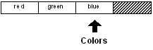

The `colors` variable is now at the last color in the block, but it is not yet to the tail position.

```
print tail? colors
false

```

To reach the tail, it has to be moved to the next position:

```
colors: next colors

```

Now the `colors` variable is resting at the tail of the block. It is no longer positioned at a valid color. It is past the end of the block.

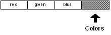

If you try your code, you will get:

```
print tail? colors
true
print index? colors
4
print length? Colors
0
print first colors
** Script Error: Out of range or past end.
** Where: print first colors

```

You receive an error in this last case because there is no valid first item when you are past the end of the block.

It is also possible to move backwards in the block. If you write:

```
colors: back colors

```

you will move the `colors` variable back one position in the series:


All of the same code will work as before:

```
print index? colors
3
print first colors
blue

```

### 1.2 Skipping Around

The previous examples move through the series one item at a time. However, there are times when you want to skip past multiple items using the **skip** function. Assume that the `colors` variable is positioned at the head of a series:


You can skip forward two items using:

```
colors: skip colors 2

```

The **skip** function is similar to **next** in that **skip** returns the series at the new position.


The following code confirms the new position:

```
print index? colors
3
print first colors
blue

```

To move backward, use **skip** with negative values:

```
colors: skip colors -1

```

This is similar to **back**. In the above example, a skip of -1 moves back one item.

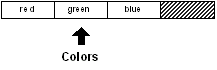

```
print first colors
green

```

Note that you cannot skip past the tail or the head of a series. If you attempt to do so, **skip** only goes as far as it can. It will not generate an error.

If you skip too far forward, **skip** returns the tail of the series:

```
colors: skip colors 20

print tail? colors
true

```

If you skip too far back, **skip** returns the head of the series:

```
colors: skip colors -100

print head? colors
true

```

To skip directly to the head of the series, use the **head** function:

```
colors: head colors

print head? colors
true
print first colors
red

```

You can return to the tail with the **tail** function:

```
colors: tail colors

print tail? colors
true

```

### 1.3 Extracting Values

Some of the previous examples made use of the **first** and **second** `ordinal` functions to extract specific values from a series. The full set of ordinal functions is:

```
first
second
third
fourth
fifth
last

```

Ordinal functions are provided as a convenience, and are used for picking values from the most common position in a series. Here are some examples:

```
colors: [red green blue gold indigo teal]

print first colors
red
print third colors
blue
print fifth colors
indigo
print last colors
teal

```

To extract from a numeric position, use the pick function:

```
print pick colors 3
blue
print pick colors 5
indigo

```

A shorthand notation for pick is to use a path:

```
print colors/3
blue
print colors/5
indigo

```

Remember, as shown earlier, extraction is performed `relative` to the series variable that you provide. If the `colors` variable were at another position in the series, the results would be different.

Extracting a value past the end of its series generates an error in the case of the ordinal functions and returns **none** in the case of the **pick** function or a pick path:

```
print pick colors 10
none
print colors/10
none

```

### 1.4 Extracting a Sub-series

You can extract multiple values from a series with the **copy** function. To do so, use **copy** with the **/part**refinement, which specifies the number of values that you want to extract:

```
colors: [red green blue]

sub-colors: copy/part colors 2

probe sub-colors
[red green]

```

Graphically, this would look like:

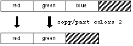

To copy a sub-series from any position within the series, first traverse to the starting position. The following example moves forward to the second position in the series using **next** before performing the copy:

```
sub-colors: copy/part next colors 2

probe sub-colors
[green blue]

```

This would be diagrammed as:

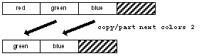

The length of the series to copy can be specified as an ending position, as well as a copy count. Note that the position indicates `where` the copy should stop, not the ending position.

```
probe copy/part colors next colors
[red]
probe copy/part colors back tail colors
[red green]
probe copy/part next colors back tail colors
[green]

```

This can be useful when the ending position is found as the result of the **find** function:

```
file: %image.jpg

print copy/part file find file "."
image

```

### 1.5 Inserting and Appending

You can insert one or more new values into any part of a series using the **insert** function. When you insert a value at a position in a series, space is made by shifting its prior values toward the tail of the series.

For instance, the block:

```
colors: [red green]

```

would be shown as:

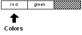

To insert a new value at the head of the block where the `colors` variable is now positioned:

```
insert colors 'blue

```

The `red` and `green` words are shifted over and the `blue` word (which is prefixed with a tick because it is a word and should not be evaluated) is inserted at the head of the list.


Note that the `colors` variable remains positioned at the head of the list.

```
probe colors
[blue red green]

```

Also note that the return from the **insert** function was not used because it was not set to a variable or passed along to another function. If the return had been used to set the value of the `colors` variable with the line:

```
colors: insert colors 'blue

```

the effect on the block would have been the same, but the position of the `colors` variable would have changed as a result of setting the return value. The position returned from **insert** is immediately following the insertion point.

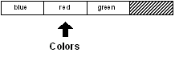

An insertion can be made anywhere in the series. The position of the insert can be specified, and it can include the tail. Inserting at the tail has the effect of appending to the series.

```
colors: tail colors

insert colors 'gold

probe colors
[blue red green gold]

```

Before the insertion:

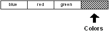

After the insertion:

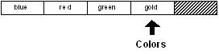

The word `gold` has been inserted at the tail of the series.

Another way to insert at the tail of a series is with the **append** function. The **append** function works in the same way as **insert**, but always inserts at the tail. The previous example would become:

```
append colors 'gold

```

The result is the same as the previous example.

The **insert** and **append** function also accept a block of arguments to insert. As an example:

```
colors: [red green]

insert colors [blue yellow orange]

probe colors
[blue yellow orange red green]

```

If you want to insert the new values between the `red` and `green` words:

```
colors: [red green]

insert next colors [blue yellow orange]

probe colors
[red blue yellow orange green]

```

The **insert** and **append** functions have other capabilities that are covered in more detail in a later section.

### 1.6 Removing Values

You can remove one or more values from any part of a series by using the **remove** function.

For instance, starting with the block:

```
colors: [red green blue gold]

```

As shown here:

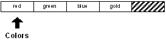

You can remove the first value from the block with the line:

```
remove colors

```

The block becomes:

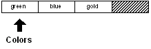

It can be printed with:

```
probe colors
[green blue gold]

```

The **remove** function removes values relative to the position of the `colors` variable. You can remove values from anywhere in the series by setting the position.

```
remove next colors

```

The block is now:


Multiple values can be removed by supplying the **/part** refinement.

```
remove/part colors 2

```

This removes the remaining values, leaving an empty block:


Similar to **insert/part**, the argument to **remove/part** can also be a position within the block.

Removing all of the remaining values is a common operation. The **clear** function is provided to make this more direct. **Clear** removes all values from the current position to the tail. For example:

```
Colors: [blue red green gold]

```

As shown here:

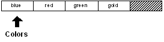

Everything after blue can be removed with:

```
clear next colors

```

The block becomes:

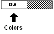

You can easily clear the entire block with:

```
clear colors

```

### 1.7 Changing Values

One additional set of functions is provided for changing values in a series. The **change** function replaces one or more values with new values. Although this can be accomplished by removing and inserting values, it is more efficient to use **change**.

Defining the block:

```
colors: [blue red green gold]

```


Its second value could be changed with the line:

```
change next colors 'yellow

```

And it would become:

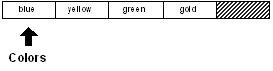

The block would now become:

```
probe colors
[blue yellow green gold]

```

The **poke** function allows you to specify that the change occur at a particular position relative to the `colors`variable. The **poke** function is similar to the **pick** function described earlier.

```
poke colors 3 'red

```

The block is now:

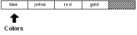

As proven by:

```
probe colors
[blue yellow red gold]

```

The **change** function has additional refinements that are described later in this chapter.

## 2. Series Functions

Here is a summary of the functions that operate on series. Most of these were described in detail in the previous section. Others will be covered in more detail in this section.

### 2.1 Creation Functions

| Function | Description                           |
| -------- | ------------------------------------- |
| **make** | Makes a new series of the given type. |
| **copy** | Copies a series.                      |

### 2.2 Navigation Functions

| Function | Description                              |
| -------- | ---------------------------------------- |
| **next** | Returns the next position in a series.   |
| **back** | Returns the previous position in a series. |
| **head** | Returns the head position of a series.   |
| **tail** | Returns the tail position of a series.   |
| **skip** | Returns the position plus or minus an integer. |
| **at**   | Returns the position plus or minus an integer, but uses the same indexing as **pick**. |

### 2.3 Information Functions

| Function    | Description                              |
| ----------- | ---------------------------------------- |
| **head?**   | Returns `true` if at the head of the series. |
| **tail?**   | Returns `true` if at the tail of the series. |
| **index?**  | Returns the offset from the head of the series. |
| **length?** | Returns the length of a series from the current position. |
| **offset?** | Returns the distance between two series positions. |
| **empty?**  | Returns `true` if the series is empty from this position. |

### 2.4 Extraction Functions

| Function      | Description                              |
| ------------- | ---------------------------------------- |
| **pick**      | Extracts a single value from a position in a series. |
| **copy/part** | Extracts a sub-series from a series.     |
| **first**     | Extracts the first value from a series.  |
| **second**    | Extracts the second value from a series. |
| **third**     | Extracts the third value from a series.  |
| **fourth**    | Extracts the fourth value from a series. |
| **fifth**     | Extracts the fifth value from a series.  |
| **last**      | Extracts the last value from a series.   |

### 2.5 Modification Functions

| Function   | Description                              |
| ---------- | ---------------------------------------- |
| **insert** | Inserts values into a series.            |
| **append** | Appends values to the tail of a series.  |
| **remove** | Removes values from a series.            |
| **clear**  | Clears values to the tail of a series.   |
| **change** | Changes values in a series.              |
| **poke**   | Changes values at a position in a series. |

### 2.6 Search Functions

| Function    | Description                              |
| ----------- | ---------------------------------------- |
| **find**    | Finds a value in a series.               |
| **select**  | Finds an associated value in a series.   |
| **replace** | Searches and replaces values in a series. |
| **parse**   | Parses values in a series.               |

### 2.7 Ordering Functions

| Function    | Description                              |
| ----------- | ---------------------------------------- |
| **sort**    | Sorts the values in a series into an order. |
| **reverse** | Reverse the order of values in a series  |

### 2.8 Data Set (Group) Functions

| Function       | Description                              |
| -------------- | ---------------------------------------- |
| **unique**     | Returns a unique set of values, removing duplicates. |
| **intersect**  | Returns only the values found in both series. |
| **union**      | Returns the combined values from two series. |
| **exclude**    | Returns one series less another.         |
| **difference** | Returns the values not found in either series. |

## 3. Series Datatypes

All series datatypes can be divided into two broad classes. Each includes a datatype value and a type test function.

### 3.1 Block Types

| Block Type | Description                              |
| ---------- | ---------------------------------------- |
| **Block!** | Blocks of values                         |
| **Paren!** | Blocks of values enclosed in parentheses |
| **Path!**  | Paths of values                          |
| **List!**  | Linked lists                             |
| **Hash!**  | Associative arrays                       |

### 3.2 String Types

| String Type | Description                        |
| ----------- | ---------------------------------- |
| **String!** | Character strings                  |
| **Binary!** | Byte strings                       |
| **Tag!**    | HTML and XML tags                  |
| **File!**   | File names                         |
| **URL!**    | Internet uniform resource locators |
| **Email!**  | Email names                        |
| **Image!**  | Image data                         |
| **Issue!**  | Sequence codes                     |

### 3.3 Pseudo-types

Series datatypes are grouped into a few pseudo-types that make function argument and type testing easier:

| Pseudo-type     | Description                 |
| --------------- | --------------------------- |
| **Series!**     | A series datatype           |
| **Any-block!**  | Any of the block datatypes  |
| **Any-string!** | Any of the string datatypes |

### 3.4 Type Test Functions

Block type tests:

```
Block? Paren? Path? List? Hash?

```

String type tests:

```
String? Binary? Tag? File? URL?

Email? Image? Issue?

```

Other series type tests:

```
Series? Any-block? Any-string?

```

## 4. Series Information

### 4.1 Length?

The length of a series is the number of items (values for a block or characters for a string) from the `current`position to the **tail**. If the current position is the head of the series, then the length is the number of items in the entire series.

The **length?** function returns the number of items to the tail.

```
colors: [blue red green]
print length? colors
3

```

All three values are part of the length:

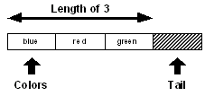

If the position of the `color` variable is advanced to the next value:

```
color: next color
print length? color
2

```

the length becomes two:

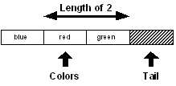

Other examples of **length?:**

```
print length? "Ukiah"
5
print length? []
0
print length? ""
0
data: [1 2 3 4 5 6 7 8]
print length? data
8
data: next data
print length? data
7
data: skip data 5
print length? data
2

```

### 4.2 Head?

The head of a series is the position of its first value. If a series is at its head, the **head?** function returns true:

```
data: [1 2 3 4 5]
print head? data
true
data: next data
print head? data
false

```

### 4.3 Tail?

The tail of a series is the position `immediately` following the last value. If a series variable is at the tail, the **tail?**function returns true:

```
data: [1 2 3 4 5]
print tail? data
false
data: tail data
print tail? data
true

```

The **empty?** function is equivalent to the **tail?** function.

```
print empty? data
true

```

If **empty?** returns `true`, it means there are no values between the current position and the **tail;** however, there still may be values in the series. Values can still be present before the current position. If you need to determine if the series is empty from head to tail, use:

```
print empty? head data
false

```

### 4.4 Index?

The `index` is the position in a series relative to the head of the series. To determine the index position for a series variable, use the **index?** function:

```
data: [1 2 3 4 5]
print index? data
1
data: next data
print index? data
2
data: tail data
print index? data
6

```

### 4.5 Offset?

The distance between two positions in a series can be determined with the **offset?** function.

```
data: [1 2 3 4]
data1: next data
data2: back tail data
print offset? data1 data2
4

```

In this example, the offset is the difference between position 2 and position 4:

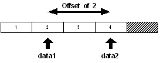

## 5. Making and Copying Series

New series are created with the **make** and **copy** functions.

Use the **make** function to create a new series from a series datatype and an initial size. The size is an estimate of the size needed for the series. If the initial size is too small, the series will automatically expand, but at a slight performance cost.

```
block: make block! 50

string: make string! 10000

list: make list! 128

file: make file! 64

```

The **copy** function creates a new series by copying an existing series:

```
string: copy "Message in a bottle"

new-string: copy string

block: copy [1 2 3 4 5]

new-block: copy block

```

Copying is also important for use with functions that modify the contents of a series. For instance, if you want to change the case of a string without modifying the original, use the **copy:**

```
string: uppercase copy "Message in a bottle"

```

### 5.1 Partial Copies

The **copy** function **/part** refinement takes a single argument, which is either an integer specifying the number of items to copy or a position within the series indicating the last position to copy.

```
str: "Message in a bottle"
print str
Message in a bottle
print copy/part str find str " "
Message
new-str: copy/part (find str "in") (find str "bottle")
print new-str
in a
blk: [ages [10 12 32] sizes [100 20 30]]
new-blk: copy/part blk 2
probe new-blk
[ages [10 12 32]]

```

### 5.2 Deep Copies

Many blocks contain other blocks and strings. When such a block is copied, its sub-series are not copied. The sub-series are referred to directly and are the same series data as the original block. If you modify any of these sub-series, you modify them in the original block as well.

The **copy/deep** refinement forces a copy of all series values within a block:

```
blk-one: ["abc" [1 2 3]]
probe blk-one
["abc" [1 2 3]]

```

The next example assigns a normal copy of `blk-one` to `blk-two:`

```
blk-two: copy blk-one
probe blk-one
["abc" [1 2 3]]
probe blk-two
["abc" [1 2 3]]

```

If either the string or block contained in `blk-two` is modified, the series values in `blk-one` are also modified.

```
append blk-two/1 "DEF"
append blk-two/2 [4 5 6]
probe blk-one
["abcDEF" [1 2 3 4 5 6]]
probe blk-two
["abcDEF" [1 2 3 4 5 6]]

```

Using **copy/deep** makes a copy of all series values found in the block:

```
blk-two: copy/deep blk-one
append blk-two/1 "ghi"
append blk-two/2 [7 8 9]
probe blk-one
["abcDEF" [1 2 3 4 5 6]]
probe blk-two
["abcDEFghi" [1 2 3 4 5 6 7 8 9]]

```

### 5.3 Initial Copies

When initializing a string or block series, use **copy** on the value to make is a unique series:

```
str: copy ""
blk: copy []

```

Using **copy** assures that a new series is created for the word every time the word is initialized. Here is an example of why this is important.

```
print-it: func [/local str] [
    str: ""
    insert str "ha"
    print str
]

print-it
ha
print-it
haha
print-it
hahaha

```

In this example, because **copy** wasn't used, the empty string series is modified with every call of `print-it`. The string series `ha` is inserted into `str` each time `print-it` is called.

Examining the source of the function as it now exists exposes the root of the problem:

```
source print-it
print-it: func [/local str] [
    str: "hahaha"
    insert str "ha"
    print str
]

```

Although `str` is a local variable, its string value is global. To avoid this problem, the function should **copy** the empty string or use **make** on the string.

```
print-it: func [/local str] [
    str: copy ""
    insert str "ha"
    print str
]

print-it
ha
print-it
ha
print-it
ha

```

## 6. Series Iteration

You can use a loop to traverse a series. There are a few loop functions that can help automate the iteration process.

### 6.1 Foreach Loop

The **foreach** loop moves through a series setting a word or multiple words in to the values in the series.

The **foreach** loop takes three arguments: a word or a block of words that holds the values for each iteration, a series, and a block to evaluate for each iteration.

```
colors: [red green blue yellow orange gold]
foreach color colors [print color]
red
green
blue
yellow
orange
gold
foreach [c1 c2] colors [print [c1 c2]]
red green
blue yellow
orange gold
foreach [c1 c2 c3] colors [print [c1 c2 c3]]
red green blue
yellow orange gold

```

This is very useful with blocks that contain related values:

```
people: [
    "Bob" bob@example.com 12
    "Tom" tom@example.net 40
    "Sam" sam@example.org 22
]
foreach [name email age] people [
    print [name email age]
]
Bob bob@example.com 12
Tom tom@example.net 40
Sam sam@example.org 22

```

Note that the **foreach** loop does not advance the current index through the series, so there is no need to reset its series variable.

### 6.2 While Loop

The most flexible approach is to use a **while** loop, which allows you to do just about anything to the series without problems.

```
colors: [red green blue yellow orange]

while [not tail? colors] [
    print first colors
    colors: next colors
]
red
green
blue
yellow
orange

```

The method shown below allows you to **insert** values without hitting a value twice:

```
colors: head colors

while [not tail? colors] [
    if colors/1 = 'yellow [
        colors: insert colors 'blue
    ]
    colors: next colors
]

```

This example illustrates that the **insert** returns the position immediately following the insertion.

To **remove** a value without accidentally skipping a value, use the following code:

```
colors: head colors

while [not tail? colors] [
    either colors/1 = 'blue [
        remove colors
    ][
        colors: next colors
    ]
]

```

Notice that if a removal is done, the **next** function is not performed.

### 6.3 Forall Loop

The **forall** loop is similar to the **while** loop, but eliminates some of the effort required. The **forall** loop starts from the current index and advances through a series to its tail evaluating a block for every value.

The **forall** loop takes two arguments: a series variable and a block to evaluate for each iteration.

```
colors: [red green blue yellow orange]

forall colors [print first colors]
red
green
blue
yellow
orange

```

The **forall** advances the variable position through the series, so when it returns the variable is left at its tail:

```
print tail? colors
true

```

Therefore, the variable must be reset before it is used again:

```
colors: head colors

```

Also, if the block modifies the series, be careful to avoid missing or repeating a value. The **forall** loop works in some cases; however, if you are uncertain, use the **while** loop instead.

```
forall colors [
    if colors/1 = 'blue [remove colors]
    print first colors
]
red
green
yellow
orange

```

### 6.4 Forskip Loop

Similar to **forall**, the **forskip** loop advances through a series starting at the current position, but skips the specified number of values each time.

The **forskip** loop takes three arguments: a series variable, the skip between each iteration, and a block to evaluate for each iteration.

```
colors: [red green blue yellow orange]

forskip colors 2 [print first colors]
red
blue
orange

```

The forskip loop leaves the series at its tail, requiring you to reset it.

```
print tail? colors
true
colors: head colors

```

### 6.5 The Break Function

Any of the loops can be stopped at any time by evaluating the **break** function from within the evaluation block. See the [Expressions Chapter](rebolcore-4.html) for more information about the **break** function.

## 7. Searching Series

[The **find** function searches through block or string series for a value or pattern. This function has many refinements that permit a wide range of variations in search parameters.]()

### 7.1 Simple Find

The simplest and most common use of **find** is to search a block or string for a value. In this case, **find** requires only two arguments: the series to search and the value to find.

An example of using **find** on a block is:

```
colors: [red green blue yellow orange]
where: find colors 'blue
probe where
[blue yellow orange]
print first where
blue

```

The **find** function can also search for values by datatype. This can be quite useful.

```
items: [10:30 20-Feb-2000 Cindy "United"]
where: find items date!
print first where
20-Feb-2000
where: find items string!
print first where
United

```

An example of using **find** on a string is:

```
colors: "red green blue yellow orange"
where: find colors "blue"
print where
blue yellow orange

```

When a search fails, **none** is returned.

```
colors: [red green blue yellow orange]
probe find colors 'indigo
none

```

### 7.2 Refinement Summary

Find has many refinements that support a wide variety of search parameters:

| Refinement   | Description                              |
| ------------ | ---------------------------------------- |
| /**part**    | Limits a search on a series to a given length or ending position. |
| /**only**    | Treats a series value as a single value. |
| /**case**    | Uses case-sensitive string comparison.   |
| /**any**     | Allows the use of pattern wildcards that allow matches to be made with any character. An asterisk (*) in the pattern matches any string, and a question mark (?) in the pattern matches any character. |
| /**with**    | Allows pattern wildcards with different characters other than asterisk (*) and (?). This allows a pattern to contain asterisks and question marks. |
| /**match**   | Matches a pattern beginning at the current series position, rather than finding the first occurrence of a value or string. Returns the tail position if the match is found. |
| /**tail**    | Return the tail position of a match on a successful search, rather than returning the point at which the match was found. |
| /**last**    | Searches backwards for the match, starting at the tail of the series. |
| /**reverse** | Searches backwards for the match, starting at the current position. |

### 7.3 Partial Searches

The **/part** refinement allows a search to be confined to a specific portion of a series. For instance, you may want to restrict a search to a given line or section of text.

Similar to **insert/part** and **remove/part**, **find/part** takes either a count or an ending position. The following example uses a count and restricts the search to the first three items:

```
colors: [red green blue yellow blue orange gold]
probe find/part colors 'blue
[blue yellow blue orange gold]

```

The next search is restricted to the first 15 characters:

```
text: "Keep things as simple as you can."
print find/part text "as" 15
as simple as you can.

```

The next example uses an ending position. The search is restricted to a single line of text:

```
text: {
    This is line one.
    This is line two.
}

start: find text "this"
end: find start newline
item: find/part start "line" end
print item
line one.

```

### 7.4 Tail Positions

The **find** function returns the position in the series where an item was found. The **/tail** refinement returns the position immediately following the item that was found. Here's an example:

```
filename: %script.txt

print find filename "."
.txt
print find/tail filename "."
txt
clear change find/tail filename "." "r"
print filename
script.r

```

In this example, **clear** is necessary to remove `xt`, which follows `t`.

### 7.5 Backward Searches

The last example in the previous section would fail if the filename had more than one period. For instance:

```
filename: %new.script.txt
print find filename "."
.script.txt

```

In this example we want the last occurrence of the period in the string, which can be found using the **/last**refinement. The **/last** refinement searches backward through a series.

```
print find/last filename "."
.txt

```

The **/last** refinement can be combined with**/tail** to produce:

```
print find/last filename "."
txt

```

If you want to continue to search backward through the string, you need the **/reverse** refinement. This refinement performs a search from the current position backward toward the head, rather than forward toward the tail.

```
where: find/last filename "."
print where
.txt
print find/reverse where "."
.script.txt

```

Notice that **/reverse** continues the search just before the position of the last match. This prevents it from finding the same period again.

### 7.6 Repeated Searches

You can easily repeat the **find** function to search for multiple occurrences of a value or string. Here is an example that would print all the strings found in a block:

```
blk: load %script.r
while [blk: find blk string!] [
    print first blk
    blk: next blk
]

```

The next example counts the number of new lines in a script. It uses the **/tail** refinement to prevent an infinite loop and returns the position immediately following the match.

```
text: read %script.r
count: 0
while [text: find/tail text newline] [count: count + 1]

```

To perform a repeated search in reverse, use the **/reverse** refinement. The following example prints all of the index positions in reverse order for the text of a script.

```
while [text: find/reverse tail text newline] [
    print index? text
]

```

### 7.7 Matching

[The **/match** refinement modifies the behavior of **find** to perform pattern matching on the current position of a series. This refinement allows parsing operations to be performed by matching the next part of a series with expected patterns. See the chapter on ]()[Parsing](rebolcore-15.html) for another way to match series.

A simple example of matching is as follows:

```
blk: [1342 "Franklin Pike Circle"]
probe find/match blk integer!
["Franklin Pike Circle"]
probe find/match blk 1432
["Franklin Pike Circle"]
probe find/match blk "test"
none
str: "Keep things simple."
probe find/match str "keep"
" things simple."
print find/match str "things"
none

```

Notice in the example that a search is not performed. The beginning of the series either matches or it does not. If it does match, the series is advanced the position immediately following the match point, allowing you to match the next sequence.

Here is a simple parser written with **find/match:**

```
grammar: [
    ["keep" "make" "trust"]
    ["things" "life" "ideas"]
    ["simple" "smart" "happy"]
]

parse-it: func [str /local new] [
    foreach words grammar [
        foreach word words [
            if new: find/match str word [break]
        ]
       if none? new [return false]
       str: next new  ;skip space
   ]
   true
]

print parse-it "Keep things simple"
true
print parse-it "Make things smart"
true
print parse-it "Trust life well"
false

```

Matching can be made case-sensitive with the **/case** refinement.

The capability of **/match** can be greatly extended with the addition of the **/any** refinement as discussed below.

### 7.8 Wildcard Searches

The **/any** refinement enables wildcard pattern matching. The question mark (?) and asterisk (*) characters act as wildcards for matching any single character or any number of characters respectively. The **/any** refinement can be used in conjunction with **find** with or without the **/match** refinement.

Examples:

```
str: "abcdefg"
print find/any str "c*f"
cdefg
print find/any str "??d"
bcdefg
email-list: [
    mack@rebol.dom
    judy@somesite.dom
    jack@rebol.dom
    biff@rebol.dom
    jenn@somesite.dom
]
foreach email email-list [
    if find/any email *@rebol.dom [print email]
]
mack@rebol.dom jack@rebol.dombiff@rebol.dom

```

The next example uses the **/match** refinement to attempt to match the pattern to the next part of the series:

```
file-list: [
    %rebol.exe
    %notes.html
    %setup.html
    %feedback.r
    %nntp.r
    %rebdoc.r
    %rebol.r
    %user.r
]

foreach file file-list [
    if find/match/any file %reb*.r [print file]
]
rebdoc.rrebol.r

```

If either of the wildcard characters are part of what is to be matched, substitute wildcard characters can be provided using the **/with** refinement.

### 7.9 Select

A useful variation of the **find** function is the **select** function, which returns the value following the one found. The **select** function is often used to lookup a value in tagged blocks of data. The **select** function takes the same arguments as **find:** the series to search and the value find. However, unlike **find**, which returns a series position, the **select** function returns the value that follows the match.

```
colors: [red green blue yellow orange]
print select colors 'green
blue

```

Given a simple database, the **select** function can be used to access its values:

```
email-book: [
    "George" harrison@guru.org
    "Paul" lefty@bass.edu
    "Ringo" richard@starkey.dom
    "Robert" service@yukon.dom
]

```

The following code locates a specific email address:

```
print select email-book "Paul"
lefty@bass.edu

```

Use the **select** function to find a block of expressions to evaluate. For example, given the following data:

```
cases: [
    10 [print "ten"]
    20 [print "twenty"]
    30 [print "thirty"]
]

```

a block can be evaluated based on a selector`:`

```
do select cases 10
ten
do select cases 30
thirty

```

### 7.10 Search and Replace

To replace values throughout a series, you can use the **replace** function. This function searches for a specific value in a series, then replaces it with a new value.

The **replace** function takes three arguments: the series to search, value to replace, and the new value.

```
str: "hello world hello"
probe replace str "hello" "aloha"
"aloha world hello"
data: [1 2 8 4 5]
probe replace data 8 3
[1 2 3 4 5]
probe replace data 4 `four
[1 2 3 four 5]
probe replace data integer! 0
[0 2 3 four 5]

```

Use the **/all** refinement to replace all occurrences of the value from the current position to the tail.

```
probe replace/all data integer! 0
[0 0 0 four 0]
code: [print "hello" print "world"]
replace/all code 'print 'probe
probe code
[probe "hello" probe "world"]
do code
helloworld
str: "hello world hello"
probe replace/all str "hello" "aloha"
"aloha world aloha"

```

## 8. Sorting Series

The **sort** function offers a simple, quick method of sorting series. It is most useful for blocks of data, but can also be used on strings of characters.

### 8.1 Simple Sorting

The simplest examples of **sort** are:

```
names: [Eve Luke Zaphod Adam Matt Betty]
probe sort names
[Adam Betty Eve Luke Matt Zaphod]
print sort [321.3 78 321 42 321.8 12 98]
12 42 78 98 321 321.3 321.8
print sort "plosabelm"
abellmops

```

Notice that **sort** is destructive to its argument series. It reorders the original data. To prevent this, use **copy**, as in the following example:

```
probe sort copy names

```

By default, sorting is case insensitive:

```
print sort ["Fred" "fred" "FRED"]
Fred fred FRED
print sort "G4C28f9I15Ed3bA076h"
0123456789AbCdEfGhI

```

Providing the **/case** refinement makes sorting case sensitive:

```
print sort/case "gCcAHfiEGeBIdbFaDh"
ABCDEFGHIabcdefghi
print sort/case ["Fred" "fred" "FRED"]
FRED Fred fred
print sort/case "g4Dc2BI8fCF9i15eAd3bGaE07H6h"
0123456789ABCDEFGHIabcdefghi

```

Many other datatypes can be sorted:

```
print sort [1.3.3.4 1.2.3.5 2.2.3.4 1.2.3.4]
1.2.3.4 1.2.3.5 1.3.3.4 2.2.3.4
print sort [$4.23 $23.45 $62.03 $23.23 $4.22]
$4.22 $4.23 $23.23 $23.45 $62.03
print sort [11:11:43 4:12:53 4:14:53 11:11:42]
4:12:53 4:14:53 11:11:42 11:11:43
print sort [11-11-1999 10-11-9999 11-4-1999 11-11-1998]
11-Nov-1998 11-Apr-1999 11-Nov-1999 10-Nov-9999
print sort [john@doe.dom jane@doe.dom jack@jill.dom]
jack@jill.dom jane@doe.dom john@doe.dom
print sort [%user.r %rebol.r %history.r %notes.html]
history.r notes.html rebol.r user.r

```

### 8.2 Group Sorting

Often it is necessary to sort a data set that has more than one value per record. The **/skip** refinement supports this for sorting records that have a fixed length. The refinement takes one additional argument: an integer specifying length of each record.

Here is an example that sorts a block that contains first name, last name, ages, and emails. The block is sorted by its first column, first-name.

```
names: [
    "Evie" "Jordan" 43 eve@jordan.dom
    "Matt" "Harrison" 87 matt@harrison.dom
    "Luke" "Skywader" 32 luke@skywader.dom
    "Beth" "Landwalker" 104 beth@landwalker.dom
    "Adam" "Beachcomber" 29 adam@bc.dom
]
sort/skip names 4
foreach [first-name last-name age email] names [
    print [first-name last-name age email]
]
Adam Beachcomber 29 adam@bc.dom
Beth Landwalker 104 beth@landwalker.dom
Evie Jordan 43 eve@jordan.dom
Luke Skywader 32 luke@skywader.dom
Matt Harrison 87 matt@harrison.dom

```

### 8.3 Comparison Functions

The **/compare** refinement allows you to perform custom comparisons on the data being sorted. This refinement takes an additional argument, which is the comparison function to use for ordering the data.

A comparison function is written as a regular function that takes two arguments. These arguments are the values to be compared. A comparison function returns `true` if the first value should be placed before the second value and `false` if the first value should be placed after the second value.

A normal comparison places data in ascending order:

```
ascend: func [a b] [a < b]

```

If the first value is less than the second, then `true` is returned from the function and the first value is placed before the second value.

```
data: [100 101 -20 37 42 -4]
probe sort/compare data :ascend
[-20 -4 37 42 100 101]

```

Similarly:

```
descend: func [a b] [a > b]

```

If the first value is greater than the second value, then `true` is returned and the data is sorted with greater values first. The sort will descend from greater values.

```
probe sort/compare data :descend
[101 100 42 37 -4 -20]

```

Notice that in both cases the comparison function is passed by providing its name preceded with a colon. The name preceded with a colon causes the function to be passed to **sort** without first being evaluated. The comparison function could also be provided directly with:

```
probe sort/compare data func [a b] [a > b]
[101 100 42 37 -4 -20]

```

## 9. Series as Data Sets

There are a few functions that operate on series as data sets. These functions allow you to perform operations such as finding the union or intersection between two series.

### 9.1 Unique

The **unique** function returns a unique set that contains no duplicate values.

Examples:

```
data: [Bill Betty Bob Benny Bart Bob Bill Bob]
probe unique data
[Bill Betty Bob Benny Bart]
print unique "abracadabra"
abrcd

```

### 9.2 Intersect

The **intersect** function takes two series and returns a series that contains the values that are present in both series.

Examples:

```
probe intersect [Bill Bob Bart] [Bob Ted Fred]
[Bob]
lunch: [ham cheese bread carrot]
dinner: [ham salad carrot rice]
probe intersect lunch dinner
[ham carrot]
print intersect [1 3 2 4] [3 5 4 6]
3 4
string1: "CBAD"    ; A B C D scrambled
string2: "EDCF"    ; C D E F scrambled
print sort intersect string1 string2
CD

```

The intersection can be found between bitsets:

```
all-chars: "ABCDEFGHI"
charset1: charset "ABCDEF"
charset2: charset "DEFGHI"
charset3: intersect charset1 charset2

print find charset3 "E"
true
print find charset3 "B"
false

```

The **/case** refinement allows case-sensitive intersection:

```
probe intersect/case [Bill bill Bob bob] [Bart bill Bob]
[bill Bob]

```

### 9.3 Union

The **union** function takes two series and returns a series that contains all the values from both series, but no duplicates.

Examples:

```
probe union [Bill Bob Bart] [Bob Ted Fred]
[Bill Bob Bart Ted Fred]
lunch: [ham cheese bread carrot]
dinner: [ham salad carrot rice]
probe union lunch dinner
[ham cheese bread carrot salad rice]
print union [1 3 2 4] [3 5 4 6]
1 3 2 4 5 6
string1: "CBDA"    ; A B C D scrambled
string2: "EDCF"    ; C D E F scrambled
print sort union string1 string2
ABCDEF

```

The **union** function can also be used on bitsets:

```
charset1: charset "ABCDEF"
charset2: charset "DEFGHI"
charset3: union charset1 charset2

print find charset3 "C"
true
print find charset3 "G"
true

```

The **/case** refinement allows case-sensitive unions:

```
probe union/case [Bill bill Bob bob] [bill Bob]
[Bill bill Bob bob]

```

### 9.4 Exclude

The **exclude** function takes two series and returns a series that contains all the values of the first series, less the values of the second.

```
probe exclude [1 2 3 4] [1 2 3 5]
[4]
probe exclude [Bill Bob Bart] [Bob Ted Fred]
[Bill Bart]
lunch: [ham cheese bread carrot]
dinner: [ham salad carrot rice]
probe exclude lunch dinner
[cheese bread]
string1: "CBAD"    ; A B C D scrambled
string2: "EDCF"    ; C D E F scrambled
print sort difference string1 string2
AB

```

The **/case** refinement allows case-sensitive exclusion:

```
probe exclude/case [Bill bill Bob bob] [Bart bart bill Bob]
[Bill bob]

```

### 9.5 Difference

The **difference** function takes two series and returns a series that contains all of the values not in common with both series.

Examples:

```
probe difference [1 2 3 4] [1 2 3 5]
[4 5]
probe difference [Bill Bob Bart] [Bob Ted Fred]
[Bill Bart Ted Fred]
lunch: [ham cheese bread carrot]
dinner: [ham salad carrot rice]
probe difference lunch dinner
[cheese bread salad rice]
string1: "CBAD"    ; A B C D scrambled
string2: "EDCF"    ; C D E F scrambled
print sort difference string1 string2
ABEF

```

The **/case** refinement allows case-sensitive differences.

```
probe difference/case [Bill bill Bob bob] [Bart bart bill Bob]
[Bill bob Bart bart]

```

### 9.6 Exclude

A variation of the **difference** function is the **exclude** function. It returns the values that are in the first series but not found in the second series. For example:

```
probe exclude [1 2 3 4] [1 2 3 5]
[4]

```

Notice that the above result does not contain 5, as was the case with **difference** in the prior section.

```
probe exclude [Bill Bob Bart] [Bob Ted Fred]
[Bill Bart]
probe exclude "abcde" "ace"
"bd"

```

## 10. Multiple Series Variables

Multiple variables can refer to the same series. For instance:

```
data: [1 2 3 4 5]
start: find data 3
end: find start 4
print first start
2
print first end
4

```

Both the `start` and `end` variables refer to the series. They have different positions, but the series they reference is the same.

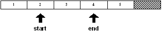

If an **insert** or **remove** function is performed on a series, the values in the series will shift and the `start` and `end` variables may no longer refer to the same values. For instance, if a value is removed from the series at the start position:

```
remove start
print first start
3
print first end
5

```

The series has shifted to the left and the variables now refer to different values.

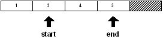

Notice that the index positions of the variables have not changed, but the values in the series have changed. The same situation would occur when using **insert**.

Sometimes this side effect will work to your advantage. Sometimes it will not, and you will need to correct for it in your code.

## 11. Modification Refinements

The **change**, **insert**, and **remove** functions can take additional refinements to modify their operation.

### 11.1 Part

The **/part** refinement accepts a count or a position in the series and uses it to limit the effect of the function.

For example, using the following series:

```
str: "abcdef"
blk: [1 2 3 4 5 6]

```

you can change part of `str` and `blk` using **change/part:**

```
change/part str [1 2 3 4] 3
probe str
1234def
change/part blk "abcd" 3
probe blk
["abcd" 4 5 6]

```

You can insert part of a series into the tail of `str` and `blk` using **insert/part**.

```
insert/part tail str "-ghijkl" 4
probe str
1234def-ghi
insert/part tail blk ["--" 7 8 9 10 11 12] 4
probe blk
["abcd" 4 5 6 "--" 7 8 9]

```

To remove part of the `str` and `blk` series, use **remove/part**. Note how **find** is used to obtain the series position:

```
remove/part (find str "d") (find str "-")
probe str
1234-ghi
remove/part (find blk 4) (find blk "--")
probe blk
["abcd" "--" 7 8 9]

```

### 11.2 Only

The **/only** refinement changes or inserts a block as a block, rather than its individual values.

Examples:

```
blk: [1 2 3 4 5 6]

```

You can replace the `2` in `blk` with the block `[a` `b` `c`] and insert the block `[$1` `$2` `$3`] at the position of the `5`.

```
change/only (find blk 2) [a b c]
probe blk
[1 [a b c] 3 4 5 6]
insert/only (find blk 5) [$1 $2 $3]
probe blk
[1 [a b c] 3 4 [$1.00 $2.00 $3.00] 5 6]

```

### 11.3 Dup

The **/dup** refinement changes or inserts a value a specified number of times.

Examples:

```
str: "abcdefghi"
blk: [1 2 3 4 5 6]

```

You can change the first four values in a string or block series to an asterisk`(*`) with:

```
change/dup str "*" 4
probe str
****efghi
change/dup blk "*" 4
probe blk
["*" "*" "*" "*" 5 6]

```

To insert a dash (-) four times before the last value in a string or block:

```
insert/dup (back tail str) #"-" 4
probe str
****efgh----i
insert/dup (back tail blk) #"-" 4
probe blk
["*" "*" "*" "*" 5 #"-" #"-" #"-" #"-" 6]
```